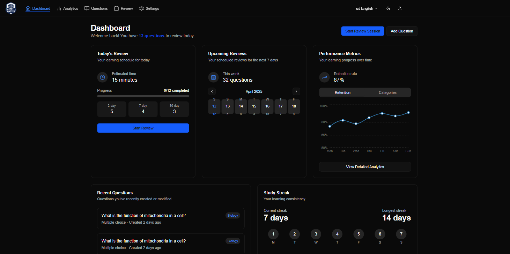
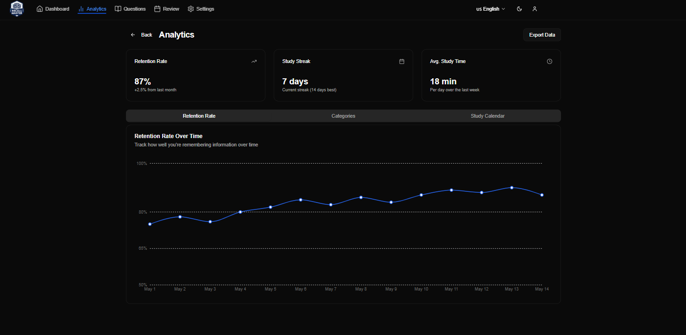
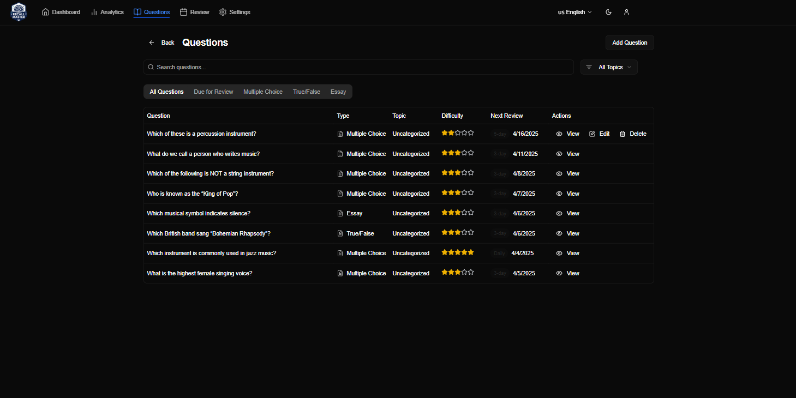
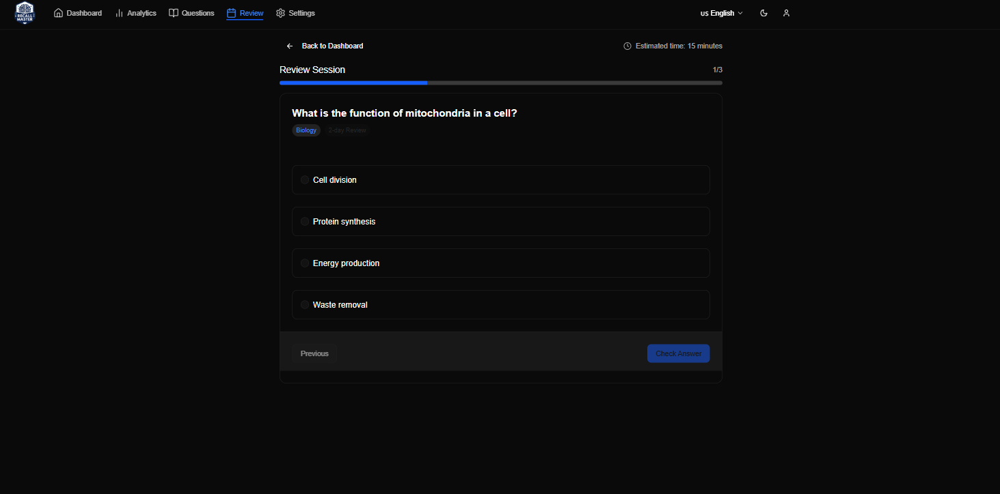

# RecallMaster - Spaced Repetition Learning Platform

RecallMaster is an interactive learning platform that helps users master concepts through spaced repetition technique. Create, manage and review questions efficiently with smart scheduling based on difficulty levels.

## 🌐 Live Demo

- Frontend: [RecallMaster App](https://recallmaster.vercel.app)
- Backend API: [RecallMaster Server](https://server-recall-master.onrender.com)

## 📸 Screenshots

### Dashboard



### Analytics



### Question Management



### Review System



## ✨ Features

- **Smart Review System**: Spaced repetition based on question difficulty
- **Multiple Question Types**: Support for multiple choice, true/false, and essay questions
- **Topic Organization**: Group questions by topics for better organization
- **Progress Tracking**: Monitor your learning progress over time
- **Responsive Design**: Works seamlessly on desktop and mobile devices

## 🛠️ Tech Stack

### Frontend

- React + Vite
- Redux Toolkit for state management
- Tailwind CSS + Shadcn/ui for styling
- RTK Query for API integration

### Backend

- Node.js + Express
- MongoDB + Mongoose
- JWT Authentication
- RESTful API

## 🚀 Getting Started

### Prerequisites

- Node.js (v14 or higher)
- MongoDB
- npm or yarn

### Installation

0. Create a file RecallMaster when open with VSCode

1. Clone the repository for frontend

```bash
git clone https://github.com/Minh20812/ReCall-Master.git
cd RecallMaster
```

2. Clone the repository for backend

```bash
git clone https://github.com/Minh20812/Server-Recall-Master.git
cd RecallMaster
```

3. Install dependencies

```bash
# Install frontend dependencies
cd Frontend
npm install

# Install backend dependencies
cd ../Backend
npm install
```

4. Set up environment variables

```bash
# In backend directory, create .env file
PORT=5001
MONGODB_URI=your_mongodb_uri
JWT_SECRET=your_jwt_secret
NODE_ENV=development

# In frontend directory, create .env file
VITE_API_URL=http://localhost:5001/api
```

5. Run the application

```bash
# Run backend (from backend directory)
npm start

# Run frontend (from frontend directory)
npm run dev
```

## 📖 API Documentation

Base URL: `https://server-recall-master.onrender.com/api`

### Main Endpoints

- `/api/auth` - Authentication routes
- `/api/questions` - Question management
- `/api/topics` - Topic management
- `/api/users` - User management

## 🤝 Contributing

Contributions are welcome! Please feel free to submit a Pull Request.

1. Fork the repository
2. Create your feature branch (`git checkout -b feature/AmazingFeature`)
3. Commit your changes (`git commit -m 'Add some AmazingFeature'`)
4. Push to the branch (`git push origin feature/AmazingFeature`)
5. Open a Pull Request

## 📝 License

This project is licensed under the MIT License - see the [LICENSE](LICENSE) file for details.

## 👤 Author

Your Name

- GitHub: [@nguyenquangminh](https://github.com/Minh20812)
- Gmail: [@ngquangminh2128@gmail.com](ngquangminh2128@gmail.com)

## 🙏 Acknowledgments

- [Shadcn/ui](https://ui.shadcn.com/) for the beautiful UI components
- [Render](https://render.com/) for hosting the backend
- [Vercel](https://vercel.app/) for hosting the frontend
